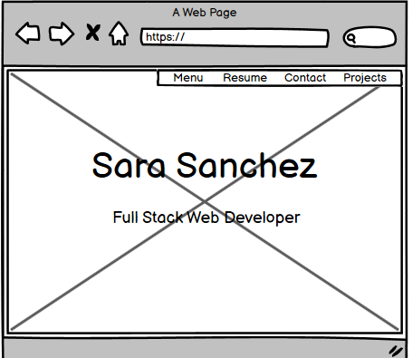
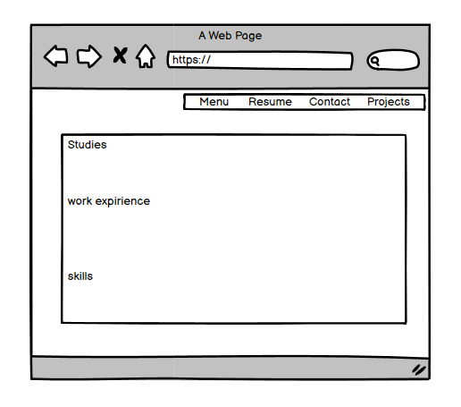
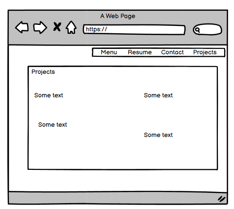
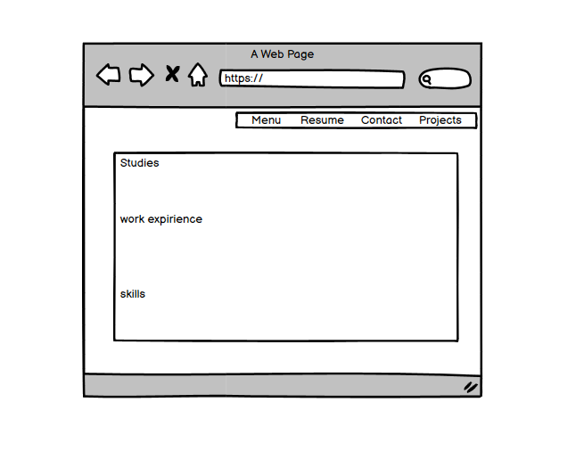

# MY PORTFOLIO #

For my first Milestone project I have decided to create my portfolio web in a way that with the time will be very easy to adjust and modify in terms of
new skills and expierience are gained during my time as a Code Institute student and profesional expirience is acquired in the future.
The way my portfolio is been designed and structured completely cuptures my essence; the colors chosen, the fonts, the images, 
they all express and discribe my persona in a way.
I felt very special during the proccess of the creation of this project , not only because was my first time developing something on my own, also
because I had to capture myself into coding.

 
## UX ##

Project Goals:
 * Present my professional profile 
 * Be able to get an intern-shift where I will be able to acquire more experience and  knowledge.
 * Find a job.

### Design Process ###

##### Strategy Plane: ####

The main goal of the website is to create a good website portfolio which will help me to access to new professional opportunities.

#### Scope Plane: ####

The features of the website were developed based on user needs. In terms of what a good portfolio should have and how should be designed to be my introduction to future employers.
 * How many pages it will have.
 * Decide if the pages will be scrollable or separate.
 * Do online researches of other people online portfolios.
 * Use Code Institute Career services documentation to be able to spot which ones are my needs when creating my portfolio and CV.

#### Skeleton Plane: #### 

At this step of the designing process I have used Balsamiq wireframes to capture my overall idea and organization of the project.
Also at this step of the process is when I had my first mentor session where I had a very constructive input and feedback from my mentor who helped me to have a different vision regarding my project. 

   
    
     
     
   

 
#### Surface Plane: ####

At this stage of the process, I proceeded to start to design the website using Bootstrap. 
The hero image was taken from Unsplash library [Unsplash](https://unsplash.com/) and the picture used at the resume page was made with [Bitmoji app](https://www.bitmoji.com/).
The typography used is from Google Fonts – Raleway [Google Fonts](https://fonts.google.com/)
Colors used from the CSS3 palette color available at [W3Schools.com](https://www.w3schools.com/cssref/css_colors.asp)

## Features ##

The website counts with four different and independant pages , in within we can find , Home, Resume, Projects and Contact:

1. The Home page counts with a full screen landing image , an h1 with my name and straight down my "job role" to be. 
a header with a navbar and a footer. 
2. The Resume page stresses my an "about me" section , contact details, my education and my work expirience. 
3. The Project page is been designed with a Bootstrap card lay out, to organise and explain the projects I will be doing during the course
at Code Institute.
4. The Contact page is a direct link to send me an email , and again my contact details. Also counts with the same landing image background than the Home page. 
This is being thought as the cover and the back cover of a book. 

Features Left to Implement

* As soon as I have more personal projects I will be adding them with pictures and links
* I will be implementing JavaScript features when I will be able to.

Technologies Used:
 1. HTML5 : Used to create the form and the content of the web site
	te.
 2.	CSS3 : Used to style the HTML
 3. Bootstrap Frameworks: Used some components; Header , footer and the card layout. 
    Also used the grid system to make the website responsive for all size devices.
 4. Gitpod and Github to write , test and deploy my code. 
 5. JQuery The project uses JQuery to simplify DOM manipulation.
    

## Testing ##

I have Validated the code using: 
 * HTML   [HTML-Validator](https://validator.w3.org/#validate_by_input)
 * CSS    [CSS-Validator](https://jigsaw.w3.org/css-validator/#validate_by_input)

Tested the website in different browsers:    
* Chrome
* Edge
* Mozilla Firefox 
* Safary
    
I have also used the Inspect tool from Google Chrome to text the responsiveness of the website in different size devices. 

## Deployment ## 

This project was entirely built in Gitpod and deployed in GitHub. 

Deployment steps:

1. Log in into my GitHub 
2. Go to my repositories
3. choose the repository called 1MILESTONEPROJECT
4. Settings
5. Select Master branch
6. Validate selection.
7. The ulr of the website is displayed.

You can see the website [here](https://sarasanchezz.github.io/1MilestoneProject/)

Steps to run the code locally:

1. Open GitHub
2. Select desired repository
3. Click on clone or download .
4. Start your IDE.
5. Open the terminal.
6. Type git clone followed by the code of the repository at the terminal

## Credits ## 

### Content ###
- The content of the page is been written by me and at the projects page is been copied from the projects structure and requirements, from the module materials.
- There are some parts of the code taken from Bootstrap componenents and after have been adjusted and modified it 
 to my web needs as for example:
    - [Navbar](https://getbootstrap.com/docs/4.5/components/navbar/)
    - [Footer](https://getbootstrap.com/docs/4.5/components/card/#header-and-footer)
    - [Card-structure](https://getbootstrap.com/docs/4.5/components/card/)
### Media ### 
- The Hero image from the Website is been taken from [Unsplash](https://unsplash.com/)
- my profile picture at the resume page is been done with [Bitmoji app](https://www.bitmoji.com/)

### Acknowledgements ### 
I  founded very helpful and inspirational this websites and videos:
- [W3Schools.com](https://www.w3schools.com/cssref/css_colors.asp).
- [MDB](https://mdbootstrap.com/).
- [Designer-daily](https://www.designer-daily.com/portfolio-desig-10009)
- How to use the Bootstrap 4 grid - Demo site by Anna Gilhespy [Video](https://www.youtube.com/watch?v=zDpCejbl1sU)
- Bootstrap tutorial (Spanish) [video](https://www.youtube.com/watch?v=59pex8k8Xr8).
- Website tutorial with bootstrap [Video](https://www.youtube.com/watch?v=9cKsq14Kfsw).
- [Stackoverflow](https://stackoverflow.com/).
- Slack Community. 
- All the tutors who had assisted me during the process, the were all helpful and extremelly kind.
- Mark Railton , my mentor, I don't have enough words to thank him all the support and patience.